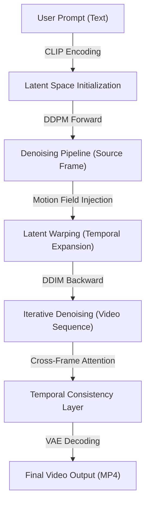

# Technical Specification: Zero-Shot Video Generation

## Architectural Overview
The **Zero-Shot Video Generation** system is a high-fidelity machine learning application that transforms text prompts into dynamic video content. Unlike traditional models that require video-specific training, this system leverages the **Text2Video-Zero** framework, utilizing a pre-trained **Stable Diffusion** backbone combined with specialized cross-frame attention mechanisms and motion field modeling to ensure temporal consistency in generated frames.

### Architectural Flow

## 1. Program Structure
The core execution logic is encapsulated within the `Source Code` directory, following a modular Python architecture designed for high-performance GPU inference.

### Core Components:
- **Model Interface (`model.py`)**: Manages the lifecycle of the diffusion pipelines, coordinating between different model types (Text2Video, Pix2Pix, ControlNet) and handling GPU memory management via `torch.cuda.empty_cache()`.
- **Text-to-Video Pipeline (`text_to_video_pipeline.py`)**: Extends the `StableDiffusionPipeline` to implement the core Text2Video-Zero logic, including `DDPM_forward` for noise injection and `warp_latents_independently` for motion field application.
- **Computation Layer (`utils.py` & `gradio_utils.py`)**: Provides utility functions for video post-processing, FFmpeg integration, and UI component rendering.

## 2. Diffusion Logic & Motion Modeling
The system utilizes a zero-shot approach where temporal coherence is achieved through mathematical transformations of latent representations rather than recurrent neural layers.

| Component | Function | Implementation Detail |
|-----------|----------|-----------------------|
| **DDPM Forward** | Noise Injection | Projects initial latents into the diffusion space based on specific timesteps ($t_0$ to $t_{Max}$). |
| **Motion Field** | Geometric Warp | Calculates pixel-level shifts ($dx, dy$) to simulate camera or object movement within the latent space. |
| **Latent Warping**| Spatial Alignment | Uses `grid_sample` with nearest-neighbor interpolation and reflection padding to translate latents across the video timeline. |

## 3. Temporal Consistency Mechanisms
A critical challenge in zero-shot generation is preventing "flicker." This system employs two primary strategies:
1. **Cross-Frame Attention**: Replaces standard self-attention in the U-Net with a mechanism that attends to the first frame (anchor frame) of the sequence, ensuring that semantic features (colors, shapes) remain stable over time.
2. **Smooth Background Algorithm**: An optional post-processing step that identifies foreground objects using SOD (Salient Object Detection) and applies a convex combination of warped and generated latents to maintain background stability.

## 4. Input & User Interface
The application provides a professional-grade web interface powered by **Gradio**:
- **Prompt Engineering**: Support for mandatory high-quality modifiers (e.g., "8K", "dramatic lighting") and negative prompt safety filtering.
- **Parameter Control**: Real-time adjustment of `motion_field_strength`, `guidance_scale`, `video_length`, and `resolution`.
- **Hardware Integration**: Optimized for NVIDIA CUDA-enabled GPUs, utilizing `float16` precision to maximize throughput while minimizing VRAM footprint.

## 5. Metadata and Archiving
- **Citation Protocol**: Implements `CITATION.cff` for standardized academic attribution.
- **Schema Integration**: Uses `codemeta.json` to define software semantics for scholarly indexing.
- **Licensing**: Released under the **MIT License**, facilitating open-source collaboration and derivative research.

---
*Technical Specification | MEng Computer Engineering Project | Version 1.0*
