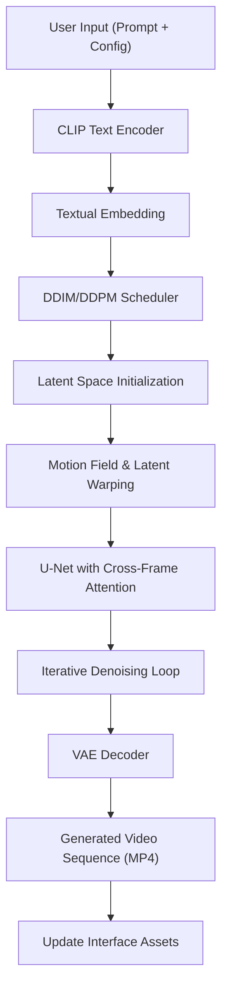

# Technical Specification: Zero-Shot Video Generation

## Architectural Overview

**Zero-Shot Video Generation** is an advanced neural synthesis framework designed to transform textual descriptions into high-fidelity, temporally consistent video sequences. This system leverages a training-free paradigm of cross-domain latent transfer—repurposing pre-trained **Latent Diffusion Models (LDM)**—combined with specialized cross-frame attention mechanisms and motion field modeling to achieve zero-shot video synthesis.

### Neural Pipeline Flow

---

## Technical Implementations

### 1. Engine Architecture
-   **Core Interface**: Built on **Gradio**, providing a highly responsive and intuitive web-based HMI for real-time interaction and synthesis monitoring.
-   **Neural Topology**: Employs a zero-shot decoupled architecture leveraging foundational **Stable Diffusion** backbones, allowing for high-performance generation without video training.

### 2. Logic & Inference
-   **Temporal Consistency**: Implements a specialized inference-time logic using **Cross-Frame Attention** to ensure semantic features remain stable across sequential latents.
-   **Motion Modeling**: Calculates latent warping trajectories based on geometric motion fields (dx, dy), strictly coupling structural dynamics with textual semantics.
-   **Background Stabilization**: Utilizes **Salient Object Detection** and latent blending to minimize temporal flickering in static regions of the generated scene.

### 3. Deployment Pipeline
-   **Local Runtime**: Optimized for execution on **Python 3.8+** with PyTorch backends, specifically tuned for hardware acceleration via **NVIDIA CUDA**.
-   **Studio Studio Environment**: Configured for both local execution and cloud-based experimentation (Google Colab/Kaggle), ensuring high-performance accessibility.

---

## Technical Prerequisites

-   **Runtime**: Python 3.8.x environment with Git and FFmpeg installed.
-   **Hardware**: Minimum 12GB VRAM; NVIDIA GPU with CUDA support highly recommended for temporally dense generation.

---

*Technical Specification | Master of Engineering (M.Eng) Project | Version 1.0*
